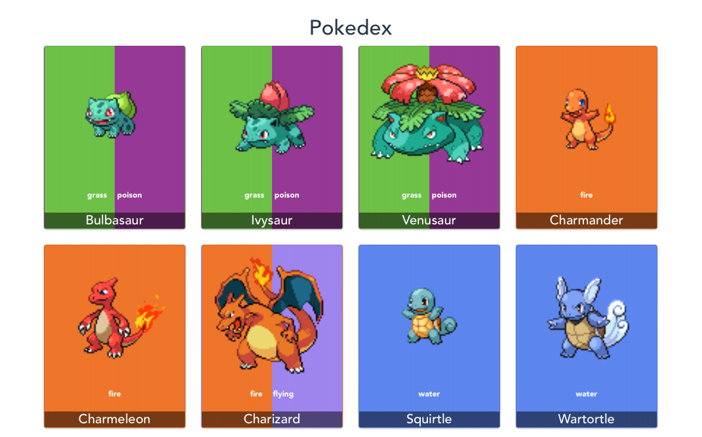
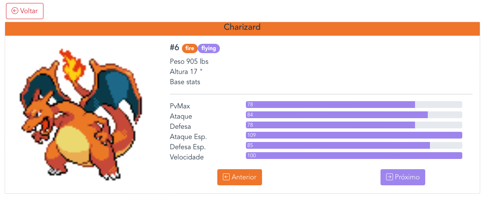
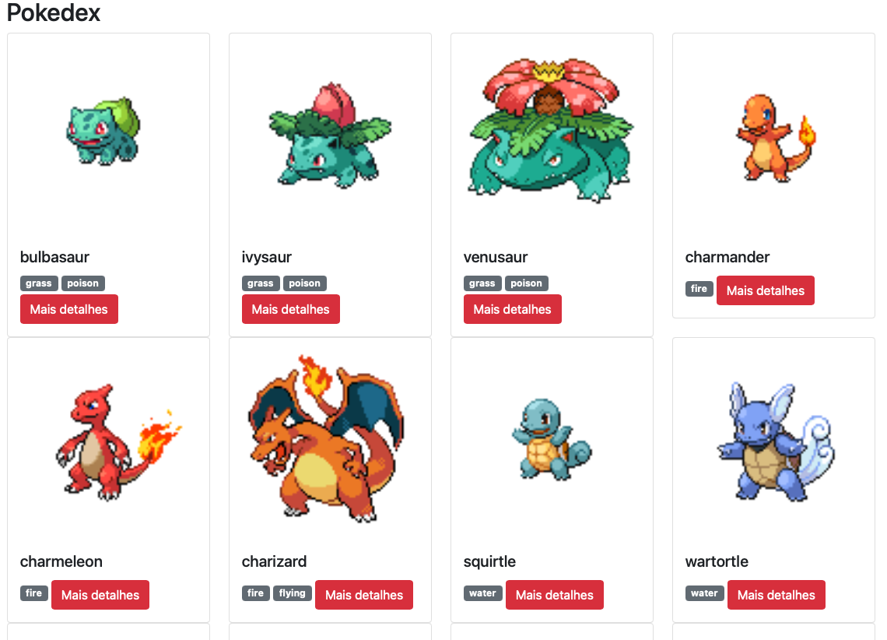
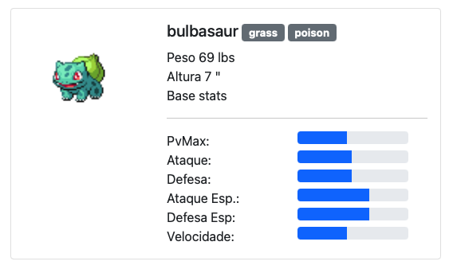

## Pokedex

The idea of this repo is to evolve a Pokedex starting with pure Node.js + Typescript
to a final version using Node.js, TypeScript, Vue and Mongodb.

- v4: (Node + Express) + (Node + Vue + VueRouter)

- v3: (Node + Express) + (Node + Vue + Vuex + VueRouter)

- [v2: Node + Express + Handlebras](../../commit/3f5c6858361d981735e01de3c3af79ba22209b62):

- [v1: Pure Node + TypeScript](../../commit/d7ac067b7ae0e9a444ff8fc35e91f2cd86a1bd7d):

